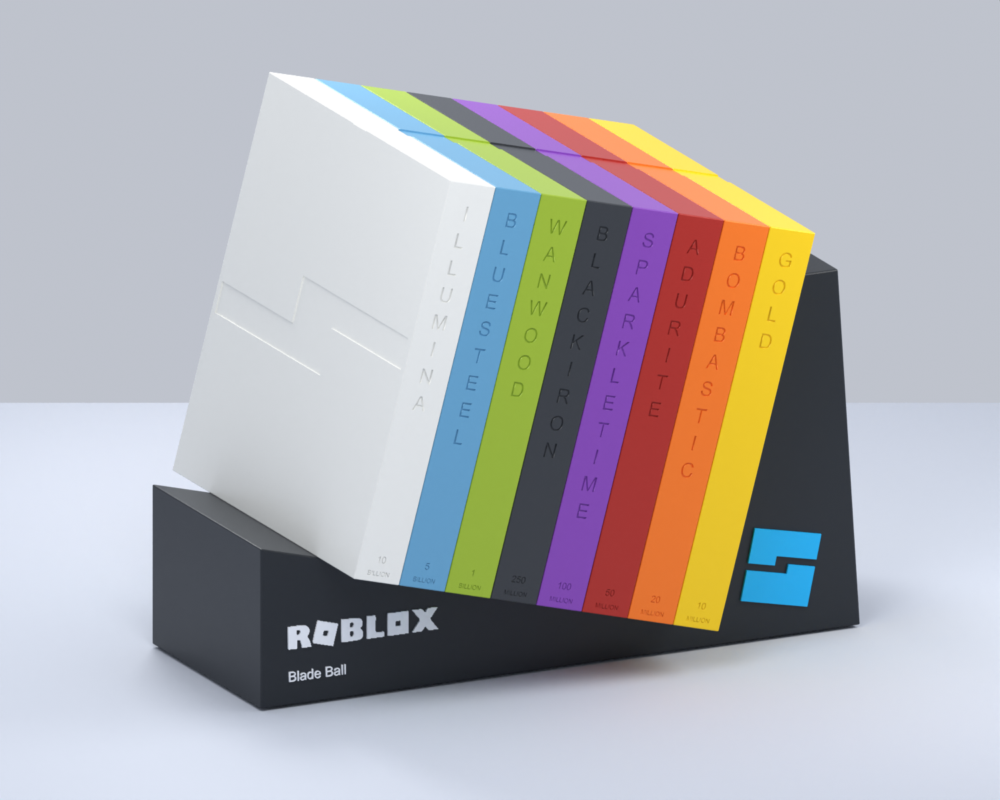
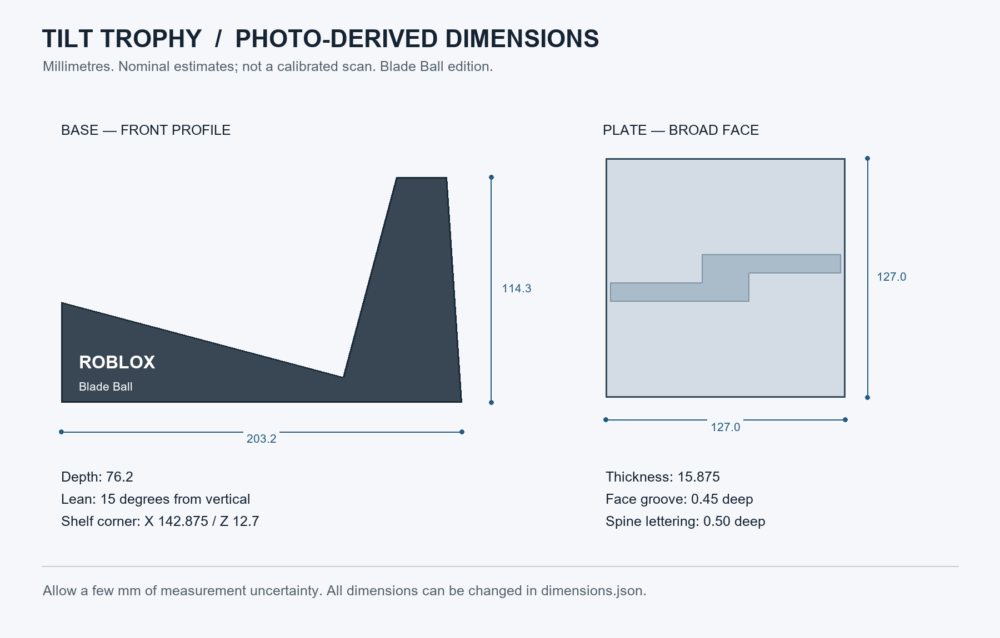

# Roblox Tilt Trophy

3d printable Roblox tilt trophy, because Roblox stopped sending these out.

I wanted to recreate it. Made in Blender using photos of my trophy with a ruler to get it as close as possible. Too lazy to buy a digital scanner or digital calipers

## What's included

- All 8 milestone plates, from Gold to Illumina.
- The base, with Blade Ball as the example game.
- An editable Blender file so you can change the text for your own games.
- STL and 3MF files, plus a split base if the full one doesn't fit your printer.

## Printing

Download the [3MF](3MF) or [STL](STL) files and open them in Bambu Studio or your slicer. Use 100% scale in millimeters. Pick whatever colors you want.

Print the base and the plates separately. The files are already laid out in their printing orientation. If you're using the split base, print both halves and 2 alignment pins, then glue the halves together.

The files passed mesh checks, but haven't been physically test printed yet. Try one plate first and check the small lettering in your slicer before printing a full set.

## Changing the text

1. Open [the Blender file](Tilt_Trophy_Blade_Ball.blend) in Blender 3.4 or newer.
2. Select `EDIT_Game_Name`, press Tab, and replace Blade Ball with your game name. Press Tab again when you're done.
3. In Blender's Text Editor, select the included `EXPORT_PRINT_FILES.py` script and run it to update the STL and 3MF files.

Save a copy in a separate folder for each game. The export script writes the print files next to your Blender file and replaces any previous exports there.

## Dimensions

These are estimates from the photos, so don't expect a perfect fit with original trophy parts. I have a scan of my trophy if someone really cares to make it perfect, just hmu for it.

